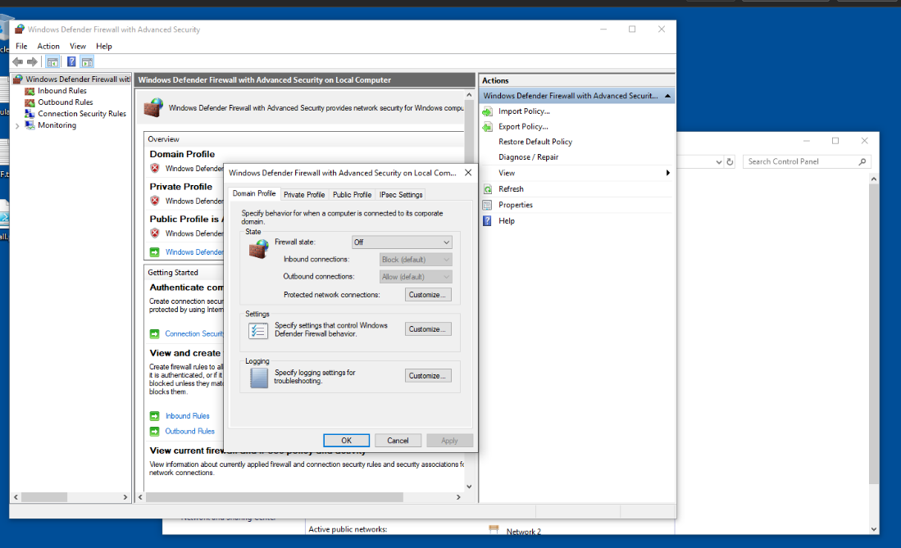
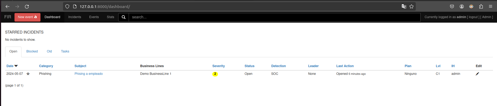
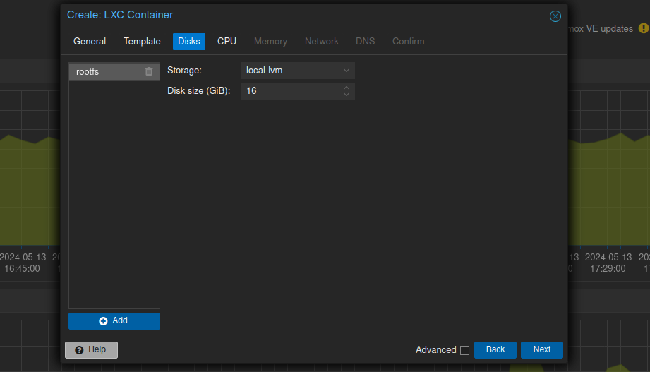
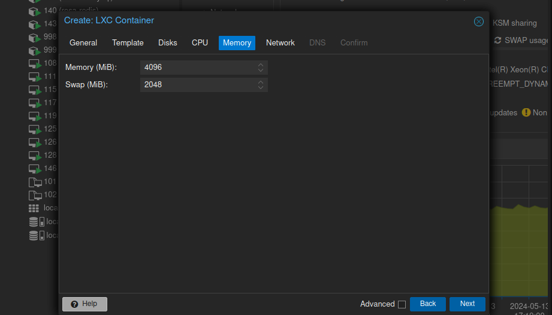
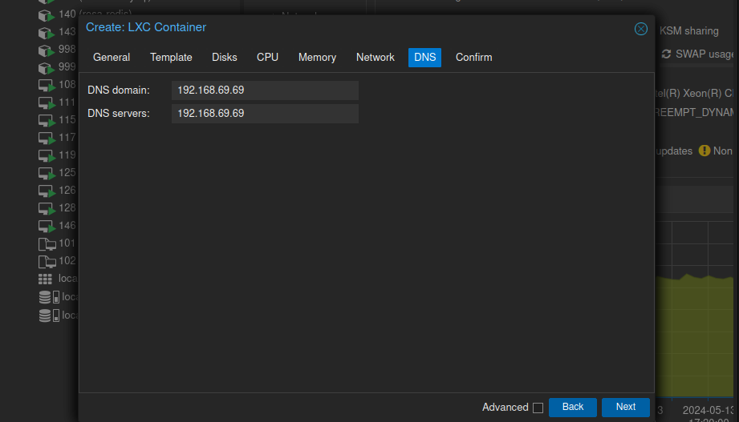

# Infraestructura de la red


## Instalacion pfsense

## Configuracion pfsense

En modo terminal configuramos que boca sera la WAN , que boca la LAN, la IP de cada uno, el servicio DHCP en la LAN y habitlitamos la interhaz Web.

Via Web, configuramos la contraseña de admn (por defecto **pfsense**), los DNS del sistema operativo, puerta de enlace, servicios de DNS, servidores DNS para el servicio DNS.

A continuacion instalamos los paquetes:

* **snort**: es el conocido IPS(Sistema de prevencion de intrusiones)/IDS (Sistema de deteccion de intrusiones) Estamos hablando de IPS cuando avtivamos el bloqueo de IPs que ofenden reglas.


* **pfblockerNG**: Bloqueador de contenido en base a dominios y direcciones IP. Caegamos listas negras desde Internet y asi bloqueamos contenido como: pornografia, paginas de apuestas, y juegos, de contenido ofensivo 

* **darkstat** puerto(6666) Genera estadisticas por dirección IP, MAC, Protocolos y puertos.

* **ntopng** puerto (3000) Monitor de red (se puede ver flujos y hacer capturas )

### Configuracion de Snort

Configuración Interfaz Lan


Alertas de snort


### pfBlocker

Habilitamos listas de PR1, PRI4 y PRI5 Asi como DBSBL

Configuración principal de pfblocker


**Feeds:**
Son las listas que agrupan ips en funcion de su categoria


**DNSBL**

En este apartado podemos cargar listas de dns que queremos bloquear en nuestra red, estan agrupadas por categorias, por ejemplo para bloquear anuncios, sitios webs maliciosos, etc...


**Alertas de pfblocker**

En este apartado podemos observar las alertas que nos saltan de pfblocker y quedan registradas en pfsense


### DarkStat

Ponerle una contraseña de acceso

Configuración de darkstat


### NtopNG

Ponerle una contraseña de acceso


## Como usar un OVA en proxmox 

Para usar una OVA en Proxmox, por ssh subimos el archivo OVA al servidor
En este caso tenemos la OVA de un widows10, desde nuestro servidor 
Desempaquetamos el OVA con tar: tar -xf archivo.ova

Vamos a suponer que tenemos [un OVA de windows 10 como este] 

Buscamos el archivo VMDK, que sera el disco de WIndows 10

Creamos una maquina virtual para windows 10, No le ponemos ni CDROM ni disco duro, Solo 12 GB RAM, 6 cores y BIOS normal, Una vez creada buscamos el numero o el ID de la maquina virtual y con el, desde la linea de comandos en proxmox hacemos:

```bash
qm disk import 102 'MSEdge - Win10-disk001.vmdk' local-lvm --format qcow2
```

Esto importa el disco `MSEdge -I Win10-disk001.vmdk` en la maquina 102, lo guarda en el espacio de almacenamiento local-lvm (en esa particion) Una vez acaba el proceso el disco aparece en la maquina pero sin conectar. Hacemos doble clic y lo añadimos como SATA 0

La maquina viene con 40GB, es poco, necesitamos darle otros 30GB.
pulstamos en hardware -> disk action -> resize. 


En Windows, nos vamos al administrador de discos y extendemos la particion hasta el final del disco


# Mandiant 


### Preinstalación Windows 10 flare

Desactivamos el firewall de windows 10
Desactivamos Windows defender



Desactivamos windows defender con politicas de grupo
Nos dirigimos a Edit Group Policie -> Administrative Templates -> Windows Componentes -> Windows Defender antivirus

clicamos en windows defender y nos sale una opcion "Turn off windows defender antivirus"

le damos doble click y marcamos la casilla enabled y aplicamos los cambios

Despues de la preinstalación es recomendable poner la conexion de la maquina en host-only y tomar una snapshot de esta

## Instalación w10 flare

Una vez completada la preconfiguración del entorno windows procedemos a la instalación de mandiant

Abrimos poweshell como administrador y nos descargamos el script installer.ps1 "flare"

```bash
(New-Object net.webclient).DownloadFile('https://raw.githubusercontent.com/mandiant/flare-vm/main/install.ps1',"$([Environment]::GetFolderPath("Desktop"))\install.ps1")
```

Desbloqueamos el script de instalación

```bash
Unblock-File .\install.ps1
```

Habilitamos el script de instalación

```bash
Set-ExecutionPolicy Unrestricted -Force 
```

Finalmente lo ejecutamos 

```bash
\install.ps1
```


Despues de ejecutar el script nos aparecera una interfaz grafica instalación con el que podremos elegir la selección de paquetes y las rutas de las variables de entorno


Una vez el script termina de ejecutarse, windows 10 se reinicia y ya tendriamos instalado el w10 flare


## Instalación de Ubuntu Server + ELK

Primero de todo definimos la IP Estática, modificando el fichero /etc/netplan/ 00-installer-config.yaml	


Aplicamos con el comando **netplan apply**
### Instalamos la pila ELK
```bash

sudo wget -qO - https://artifacts.elastic.co/GPG-KEY-elasticsearch | sudo gpg --dearmor -o /usr/share/keyrings/elasticsearch-keyring.gpg

sudo apt-get install apt-transport-https 
sudo apt-get update
sudo apt-get install elasticsearch 
sudo apt-get install kibana
sudo apt-get install logstash

sudo /bin/systemctl daemon-reload
sudo /bin/systemctl enable elasticsearch.service
sudo /bin/systemctl enable kibana.service

sudo systemctl start elasticsearch.service
sudo systemctl start kibana.service

```

Ahora ya podemos ver elastic en el puerto 9200 y kibana en el 5601.

El usuario será elastic y la contraseña la que se generó. (uP*pNibB9d+IzUzGemby)

Para conectar vía túnel SSH:

```bash
ssh -L 5601:localhost:5601 ubuntuserver@192.168.69.101
```

Para resetear la contraseña del superusuario elastic hacemos:

``` bash
sudo /usr/share/elasticsearch/bin/elasticsearch-reset-password -a -u elastic
```

Para generar un token para hacer el enrolment de kibana a elastic:

```bash
sudo /usr/share/elasticsearch/bin/elasticsearch-create-enrollment-token -s kibana
```

Para obtener el código por el que me pregunta kibana:

```bash 
sudo /usr/share/kibana/bin/kibana-verification-code
```


## Instalacion de Kali Purple 2024.01

Ceeamos la maquina


Indicamos la ISO


Le damos 50GB De disco duro 


Le damos 6 cores



Dejamos la maquina kali con las siguientes caracteristicas


### Configuración de kali purple

Configuración usuario

 

Particionado de disco

 

Elegimos el disco en el que queremos instalar kali

 

 

Y ya tendriamos el kali funcionando


# Telegraf

Telegraf es una base de datos de métricas opensource que aloja y mantiene todas las métricas que se le envíen mediante el agente telegraf.

Instalamos el paquete de telegraf en pfsense

 

Configuración telegraf en pfsense
Activamos telegraf y activamos que se salte la verificación ssl 


Nos conectamos por ssh al pfense y en la ruta /usr/local/etc/ modificamos telegraf.conf
Añadimos la configuración para poer conectarlo con elastic
```bash
[[outputs.elasticsearch]]
	enable_sniffer = false
	health_check_interval = "10s"
	index_name = "telegraf-%Y.%m.%d"
	manage_template = false
	overwrite_template = true
	template_name = "telegraf"
	urls = ["https://192.168.69.101:9200"]
	# timeout = "5s"
	username = "elastic"
	password = "uP*pNibB9d+IzUzGemby"
	# health_check_timeout = "1s"	
	# auth_bearer_token = "Vzlld3FJNEIyWFMyUG80US12RGc6aGVPQ2ZqR01Rc1M1cjJiTkZNOEdQQQ=="
	# force_document_id = false
	default_pipeline = "logs-pfsense.log-1.19.0"
```

Reiniciamos el servicio de telegraf

```bash
/usr/local/etc/rc.d/telegraf.sh stop
/usr/local/etc/rc.d/telegraf.sh start
```

Una vez hecho esto entramos en elastic via web y nos descargamos el certificado digital y lo importamos en el pfsense


# Creación Maquinas Django, MySQL, Redis como LXC

Primero asignamos la configuración principal, nombre, password etc


Seleccionamos la plantilla del contenedor Django


Le asignamos un espacio en el disco duro, en este caso 16GB



Le asignamos los cores de CPU


Asignamos memoria RAM



Insertamos las interfaces de red


En DNS insertamos la dirección IP de nuestro PFSENSE



Así quedaria toda la configuración de nuestra maquina una vez creada


Seguimos el mismo proceso para crear las maquinas MySQL y Redis

# FIR

### FIR COMO LXC
```bash

ssh root@proxmox
lxc-attach ID_DJANGO
git clone https://github.com/certsocietegenerale/FIR
cd FIR
apt install python3-pip python3.11-venv python3.11-dev   python3-lxml libxml2-dev libxslt1-dev default-libmysqlclient-dev
apt-get install build-essential pkg-config
python3 -m venv venv
. ./venv/bin/activate
pip3 install -r requirements.txt
./manage.py migrate
./manage.py loaddata incidents/fixtures/01-seed_data.json
./manage.py loaddata incidents/fixtures/02-dev_users.json
./manage.py runserver


Editamos el fichero:  /etc/ssh/sshd_config.d/turnkey.conf
Y cambiamos:
AllowTcpForwarding yes

Reiniciamos el servicio con:
systemctl restart sshd

Abrimos el túnel ejemplo:
ssh -L 8000:localhost:8000 root@192.168.99.23

En el navegador entramos en http://localhost:8000 con admin/admin
```


## Creación de un ticket en FIR

Creamos un ticker en fir, en este ejemplo pondremos el caso de un ataque de phising a un empleado, la calificamos de nivel 2


Y ya podriamos ver en el dashboard el ticket que acabamos de crear 


# Analisis de malware en windows 10 flare 

Primero clonamos el repositorio https://github.com/PacktPublishing/Malware-Analysis-Techniques
que contienen los malwares a analizar, en este caso vamos a analizar el chapter 2, lo descomprimimos


El zip contiene una imagen sospechosa, vamos a extraer su hash para comprobarlo en virustotal 

Observamos que virustotal nos advierte de que este hash pertenece a un archivo malicioso


Otra forma de comprobar la imagen es usando el programa filetype.exe a la imagen, en este caso nos dice que la imagen es un fichero ejecutable .exe por lo que podemos deducir que esta imagen es un malware


Podemos comprobar el codigo malicioso ofuscado que contiene este archivo ejecutable con el programa sdeep


Tambien podemos comprobar la imagen con el comando strings, al usar este comando sobre la imagen, el primer mensaje que nos salta en la salida del comando "!This program cannot be run in DOS mode." El cual ya nos dice que este fichero es un fichero ejecutable


# Recursos del servidor 

